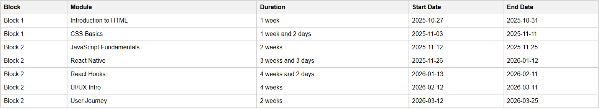

# XPL Bootcamp Timeline Generator - Standard Operating Procedure

## 1. Purpose

The Bootcamp Timeline Generator is a tool that takes in a start date and a CSV file of modules, then produces a schedule showing the start date, end date, and duration (in weeks and days) for each module. 

It automatically excludes weekends, South African public holidays, and the December shutdown period (15 Dec – 5 Jan) when calculating working days.

## 2. Data Requirements
&nbsp;2.1 CSV File Format

&nbsp;&nbsp;The CSV must contain three columns in this exact order:

&nbsp;&nbsp;| Block | Module | Duration |
&nbsp;&nbsp;| :------- | :------: | -------: |
&nbsp;&nbsp;| Block 1   | Introduction to HTML   | 5    |
&nbsp;&nbsp;| Block 1  | CSS Basics  | 7  |
&nbsp;&nbsp;| Block 1  | JavaScript Fundamentals  | 10  |
&nbsp;&nbsp;| Block 1  | React Native  | 18  |
&nbsp;&nbsp;| Block 1  | React Hooks  | 22  |
&nbsp;&nbsp;| Block 1  | UI/UX Intro  | 20  |
&nbsp;&nbsp;| Block 1  | User Journey  | 10  |

&nbsp;&nbsp;**Block**: The block or phase name (e.g., Block 1, Block 2).

&nbsp;&nbsp;**Module**: The specific training module name (e.g. Intro to Object Oriented Programming).

&nbsp;&nbsp;**Duration**: Number of working days (integer).

## Important Notes:

- Do not include headers other than **Block, Module, Duration**.

- Durations should be written in working days (e.g., 5 = one week).

## 3. Steps to Use the Generator

- Open the tool in a browser.

- Enter Start Date

- Use the date picker under “Start Date” to select the bootcamp’s official start date.

- Upload CSV

- Click “Choose File” (or “Browse”) next to “Upload CSV”.

- Select the CSV file that contains your block/module/duration data.

- Generate Timeline

- Click the Generate Timeline button.

- The system will process your file and display a table in the browser.

## 4. Understanding the Results

Once generated, the timeline table shows:

**Block**: Training block name.

**Module**: Module name.

**Duration**: Duration in weeks + days (calculated from working days).

**Start Date**: First working day of the module.

**End Date**: Last working day of the module.

## 5. Date Adjustments

- Weekends are skipped (Saturday & Sunday).

- South African public holidays are skipped automatically.

- December shutdown (15 Dec – 5 Jan) is skipped — modules pause and resume afterward.

## 6. Troubleshooting

1. Nothing happens when I click Generate Timeline

- [x] Check that both a start date and a CSV file are selected.

2. Table is empty

- [x] Make sure your CSV file is correctly formatted (no blank lines, correct headers).

3. Wrong dates in timeline

- [x] Verify durations are entered in working days, not calendar days.

## 7. Best Practices

- Always double-check the uploaded CSV before generating.

- Keep one copy of the master CSV file as backup.

- If changes are needed, edit the CSV in a text editor or Excel, then re-upload.

- Store the generated table as a reference by copying it into Excel or taking a screenshot.